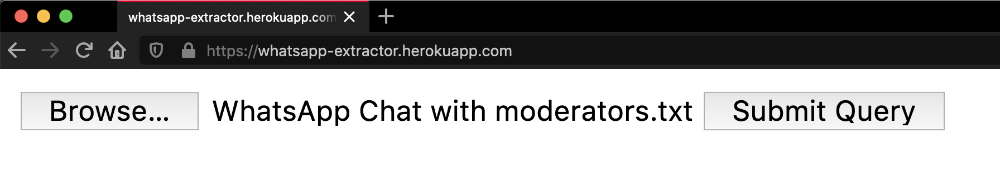

<h2 align="center">WhatsApp Extractor</h2>

# WhatsAppExtractor
Extracts necessary contents from a WhatsApp chat-export.  
## Prerequisites
- Please see the [Whatsapp FAQ](https://faq.whatsapp.com/en/android/23756533), if you want to know how to export chat conversations on whatsapp.
- Python >= 3.6 

## Usage:
1. Go to https://whatsapp-extractor.herokuapp.com/  

2. Upload the exported chat from WhatsApp.  

3. Click on submit query and download the report.  

